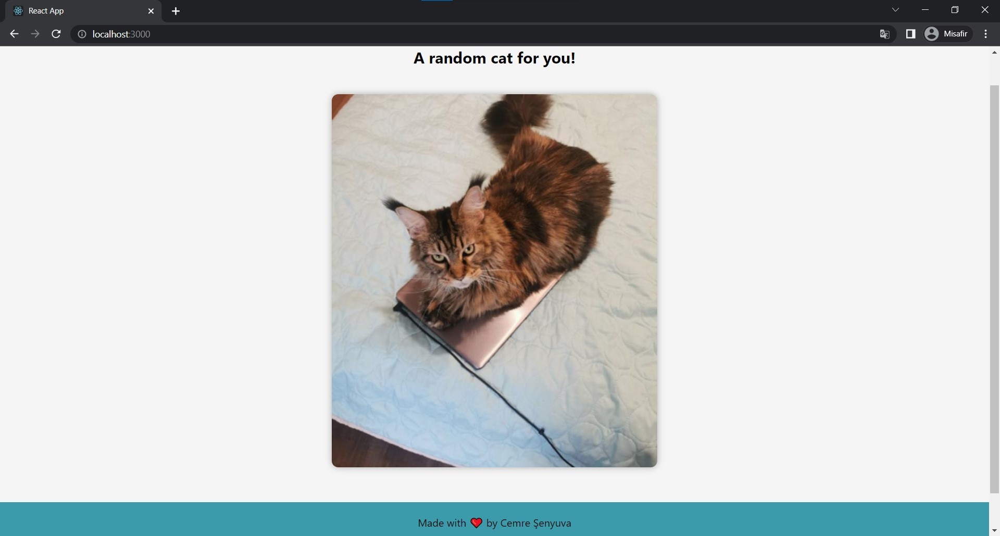

# Random Cat Picture

This is a React app with Nodejs Express backend. Every time the page is loaded a random cat picture appears!

## Demo


## Installation

Install my-project with npm

```bash
  npm install my-project
  cd my-project
```
    
## Screenshots




## License

[MIT](https://choosealicense.com/licenses/mit/)

